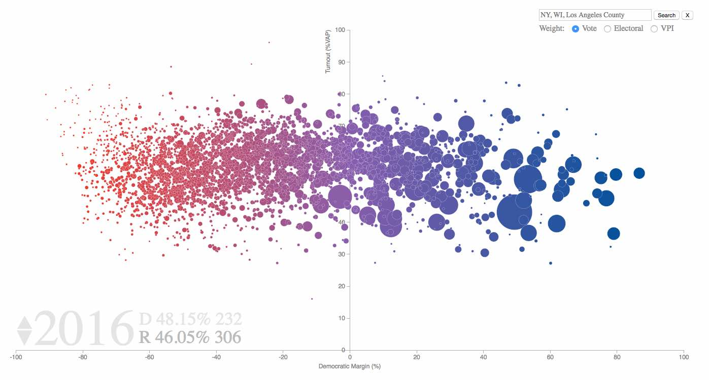

## Visualizing Voter Turnout and Margins by County, 2004 to 2016

This is an interactive visualization built with d3.js for viewing the turnout and two party margin by county.  It covers the presidential elections for 2004, 2008, 2012 and 2016.  A blog post and demo of the project are available [here](https://pstblog.com/2017/06/05/national-election-vis).  The goal is to improve the visualization and underlying data over time, so pull requests and suggestions are welcome. 

 

## Features 

* Click through years to see the changes in margin and turnout. 
* Search by state or county to view a subset of counties. 
* Bubble areas are proportional to the fraction of national votes, fraction of electoral votes, or the Voter Power Index (VPI) for each county.  
* Electoral votes and national vote percentages are tallied in the bottom left.
* Tooltips show both the county level and state level data on mouseover.
* Click and drag counties to update the vote percentages and electoral counts if the party threshold for the state is crossed.  I find this is a good way to consider "what if" scenarios for the elections. 
* A dropdown menu to switch between county, state, and different demographic data sources.    
